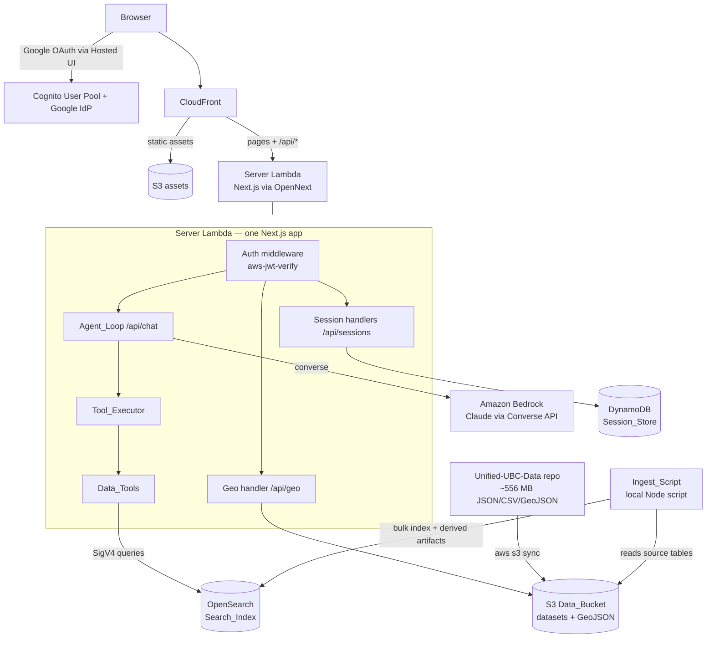

# Design Document: Campus AI Assistant

## Overview

A full-stack campus AI assistant built as **one Next.js application**. The browser side authenticates via an Amazon Cognito user pool federated with Google; the server side is the same app's API route handlers (`app/api/*`), which validate the Cognito token on every request and run a tool-calling loop against Amazon Bedrock using the non-streaming `bedrock-runtime` Converse API. The whole app deploys to AWS Lambda via **OpenNext** (the `cdk-nextjs` construct): static assets on S3/CloudFront, the server — pages and API routes alike — as one Lambda. The agent answers university questions (courses, tuition, walking distances) through four tools backed by an Amazon OpenSearch index, which an ingest script populates from datasets in S3. DynamoDB persists chat sessions and user profiles. A deck.gl map renders campus buildings and walking routes from GeoJSON in the same S3 bucket.

Merging front and back into one project also removes a latency risk: API Gateway REST has a hard ~29 s timeout, which a 10–30 s multi-tool agent response could hit. OpenNext serves the API through CloudFront → Lambda Function URL, whose origin timeout is configurable well beyond that.

The data source is the existing **Unified-UBC-Data** repository (`C:\Users\Max\Documents\AI Projects\Unified-UBC-Data`, ~556 MB): real UBC institutional data in plain JSON/CSV/GeoJSON with a `catalog.json` table index and a `QUERYING.md` join reference. The full `data/` tree is synced to the Data_Bucket; the ingest script then indexes only the tables the four tools query. Notably, section times in the source are already seconds-after-midnight integers, and the academic-calendar course table already carries `prerequisite`/`corequisite` fields parsed out of the description prose.

The whole stack is TypeScript on current tooling: AWS CDK v2 for infrastructure, a **Node.js 24** Lambda for the backend, and **Next.js 16 (App Router) / React 19** with **deck.gl v9** for the frontend. One toolchain, shared types between Lambda and frontend, and `fast-check` v4 for property-based tests of the pure logic (agent loop control, time formatting, request validation, filter semantics).

The backend's data layer is organized as **dataset modules**: each data domain (courses, tuition, buildings/walking) is one self-contained module implementing a common interface that declares its OpenSearch indices, its agent tools, and its map artifacts. The ingest script, the tool registry, the `/geo/*` endpoint, and the frontend's tool-result renderers are all driven by the module registry — adding a new data source (events, study spaces, admissions, ...) means writing one module file and registering it, with no changes to the agent loop, API, or ingest plumbing.

## Architecture



### Key decisions

- **Dataset-module registry.** Every data domain implements one `DatasetModule` interface (indices + tools + geo artifacts). Ingest, `toolConfig`, tool dispatch, and geo serving iterate the registry instead of hard-coding datasets. Extensibility is the point: the Unified-UBC-Data repo has eleven data groups and this app initially uses three — the remaining eight are one module file away each.
- **One Next.js project, one server Lambda.** API route handlers under `app/api/*` replace API Gateway + a separate backend Lambda. Same-origin API calls (no CORS), shared types by direct import, one deploy unit, one IAM role matching Requirement 8.2. Token validation happens in the app via `aws-jwt-verify` (JWKS cached across warm invocations) instead of an API Gateway authorizer.
- **GeoJSON served through the API.** The frontend fetches building/route GeoJSON via `GET /api/geo/{name}` (server reads from S3). This reuses the app's Cognito auth instead of making the bucket public.
- **OpenSearch: small provisioned domain** (`t3.small.search`, 1 node) rather than Serverless — cheaper at hackathon scale and identical query API. The Lambda signs requests with SigV4 via `@opensearch-project/opensearch` + `AwsSigv4Signer`, so switching to Serverless later is a config change.
- **Model ID from environment.** `BEDROCK_MODEL_ID` env var (Requirement 8.3); no model ID is hard-coded. The Converse API request shape is model-agnostic.
- **Ingest is a local script, not a Lambda.** Run once with developer credentials: `aws s3 sync` uploads the Unified-UBC-Data `data/` tree to S3 (the 556 MB dataset never passes through a Lambda), then the script bulk-indexes the needed tables into OpenSearch with deterministic document IDs (idempotent re-runs, Requirement 4.3).
- **Walking distances are derived at ingest.** The source has no walking-distance table, but `ubcv_buildings.geojson` has 449 building footprints with codes. Ingest computes building centroids and pairwise distances (haversine × 1.3 detour factor, 80 m/min walking speed) into a derived dataset that is both written to S3 and indexed. <!-- ponytail: straight-line approximation; upgrade path is shortest-path over ubcv_routes.geojson's pedestrian network if accuracy matters -->
- **`program_slug` is derived at ingest.** The tuition table keys rows by a `program` display name; ingest adds a slugified `program_slug` so the `get_tuition` tool input matches the requirement.

## Components and Interfaces

### Component 1: Frontend (Next.js)

**Purpose**: Sign-in, chat UI, session list, campus map.

- Auth via `react-oidc-context` against the Cognito Hosted UI (Google IdP). The Cognito **ID token** goes in the `Authorization` header of every same-origin `/api/*` call (verified server-side by `requireUser`). Token refresh via the OIDC client restores the session on return visits (Requirement 1.4).
- Chat panel: message list, input box, loading state that disables submit while a request is in flight (6.2), tool-call badges under assistant messages (6.3), error banner with a retry button that resends the failed message (6.5).
- **Tool-result renderer registry**: `renderers: Record<string, ToolCallRenderer>` maps tool name → optional React component that visualizes that tool call (e.g. `walking_distance` → map highlight + route line; `search_courses` → course cards). Unregistered tools fall back to a generic badge. Displaying data from a new backend module = registering one renderer component; the chat plumbing is untouched.
- Session sidebar: `GET /sessions` list; selecting one calls `GET /sessions/{id}` and replaces the chat state (6.4). "New chat" generates a client-side `session_id` (UUID).

**Interface** (API client):

```typescript
interface ChatApi {
  chat(sessionId: string, messages: ChatMessage[]): Promise<ChatResponse>;
  listSessions(): Promise<SessionSummary[]>;
  getSession(id: string): Promise<ChatMessage[]>;
  getProfile(): Promise<Profile>;
  putProfile(p: Profile): Promise<void>;
  getGeo(name: "buildings" | "walking-routes"): Promise<GeoJSON.FeatureCollection>;
}
```

### Component 2: Campus_Map (deck.gl)

**Purpose**: Render buildings and walking routes; visualize `walking_distance` answers.

- `GeoJsonLayer` for buildings (`/api/geo/buildings` serves `ubcv_buildings.geojson`, 449 footprint polygons, ~1 MB), with `pickable: true`; clicking shows a tooltip with `properties.NAME` and `properties.BLDG_CODE` (7.3).
- Optional base layer: `/api/geo/walking-routes` (the derived pedestrian-path GeoJSON) rendered as faint lines for context.
- When the latest chat response contains a `walking_distance` tool call, the map reads `from_building`/`to_building` from the tool input, highlights both building footprints (color override), and renders a route line between their centroids labeled with the meters/minutes from the tool result (7.2). <!-- ponytail: centroid-to-centroid line; snap to the ubcv_routes network if route fidelity matters -->
- Base map: free raster/vector tiles (e.g. CARTO basemap) under deck.gl.

### Component 3: Chat_API (Next.js route handlers)

**Purpose**: Authenticated HTTP surface inside the same app.

| Method   | Route handler                    | Purpose                    |
| -------- | -------------------------------- | -------------------------- |
| POST     | `app/api/chat/route.ts`          | Agent_Loop                 |
| GET      | `app/api/sessions/route.ts`      | list sessions for caller   |
| GET      | `app/api/sessions/[id]/route.ts` | session history for caller |
| GET, PUT | `app/api/profile/route.ts`       | read/write profile         |
| GET      | `app/api/geo/[name]/route.ts`    | GeoJSON from Data_Bucket   |

Every handler runs through a shared `requireUser(request)` helper: it verifies the `Authorization` bearer token against the Cognito user pool with `aws-jwt-verify` (issuer, audience, expiry; JWKS cached) and returns the claims, or a 401 response for missing/invalid tokens (1.2). Identity is derived exclusively from the verified token's `sub` (1.3) — never from the body. No CORS needed: the API is same-origin with the pages.

### Component 4: Agent_Loop

**Purpose**: The tool-calling loop against the Converse API.

```typescript
interface AgentResult {
  message: string; // final assistant text
  tool_calls: { name: string; input: unknown; result?: unknown }[]; // result included for frontend renderers
  warning?: string; // present iff Iteration_Limit reached
}

async function runAgentLoop(
  messages: ConverseMessage[],
  deps: { converse: ConverseFn; tools: ToolRegistry },
): Promise<AgentResult>;
```

**Behavior** (Requirements 2.2–2.7):

1. Validate body: JSON-parseable, `messages` present and non-empty, else 400 (2.8).
2. Call `converse` with the conversation, `SYSTEM_PROMPT`, and `toolConfig` (all four tool specs). Non-streaming (2.6).
3. If `stopReason === 'tool_use'`: for each `toolUse` block, dispatch via Tool_Executor, append one `toolResult` block per `toolUseId` in a single user message, record `{name, input}` in `tool_calls`, and loop (2.3).
4. If `stopReason === 'end_turn'`: return the assistant text and `tool_calls` (2.4).
5. If 8 converse calls complete without `end_turn`: stop, return best-effort text plus `warning` (2.5). `ITERATION_LIMIT = 8` is a module constant.
6. Persist the user message and final assistant message to the Session_Store (5.1), then respond.

The system prompt instructs the model to answer using tools, name the tool its data came from, and present values in human units — HH:MM times, minutes of walking, CAD amounts (2.7).

The Bedrock client, tool registry, and store are injected so the loop is unit/property-testable with a scripted `converse` mock.

### Component 5: Dataset modules (Data_Tools + Tool_Executor)

**Purpose**: One extensible pattern for every data domain — declares what to index, what tools the agent gets, and what the map can draw.

```typescript
interface DatasetModule {
  name: string;
  indices: IndexDef[]; // ingest: what this module loads into OpenSearch
  tools: ToolDef[]; // agent: what this module lets the model do
  geo?: GeoArtifact[]; // map: what this module lets the frontend draw
}

interface IndexDef {
  index: string; // OpenSearch index name
  mappings: Record<string, unknown>;
  read(s3: S3Reader): AsyncIterable<unknown>; // source table(s) -> raw records
  transform(raw: unknown): { _id: string; doc: unknown } | null; // deterministic _id; null = skip row
  derive?(s3: S3Writer): Promise<void>; // optional derived artifacts (e.g. walking_distances)
}

interface ToolDef {
  spec: ToolSpec; // Converse toolSpec: name, description, JSON input schema (3.5)
  execute(input: Record<string, unknown>, os: OsClient): Promise<unknown>;
}

interface GeoArtifact {
  name: string;
  s3Key: string;
} // exposed as GET /api/geo/{name}
```

`modules/index.ts` exports the registry: `export const modules: DatasetModule[] = [courses, tuition, buildings]`. Everything downstream derives from it:

- **Ingest** = `for (const m of modules) for (const idx of m.indices) load(idx)`.
- **`toolConfig`** = `modules.flatMap(m => m.tools.map(t => t.spec))`.
- **Tool_Executor** = lookup by tool name across modules; any thrown error, unknown name, or empty result becomes `{ status: 'error', message }` inside the `toolResult` content, and the loop continues (3.6).
- **`/api/geo/{name}`** = allowlist lookup across modules' `geo` entries → stream from S3.

Adding a data source (e.g. `events` from `data/events/`, or `spaces` from `data/learning-spaces/`) is one new module file + one registry entry; the agent loop, router, ingest runner, and IAM are untouched.

```typescript
type ToolFn = ToolDef["execute"];

async function executeTool(
  modules: DatasetModule[],
  name: string,
  input: unknown,
): Promise<{ json: unknown } | { json: { status: "error"; message: string } }>;
```

**Initial tools** (each `spec` has typed properties, descriptions, `required` list — 3.5):

| Tool               | Input                                                                               | Backing query                                                                                                                                       |
| ------------------ | ----------------------------------------------------------------------------------- | --------------------------------------------------------------------------------------------------------------------------------------------------- |
| `search_courses`   | `query` (req), `subject`, `credits`, `term`, `has_no_prereqs`, `limit` (default 20) | OpenSearch `multi_match` on title/description/code + `filter` clauses; `has_no_prereqs=true` → prerequisite field missing **or** empty string (3.1) |
| `get_course`       | `course_code` (req)                                                                 | term query on `courses` by code; returns full record incl. prerequisites/corequisites as a JSON string (3.2)                                        |
| `get_tuition`      | `program_slug`, `student_type`, `cohort_year` (all req)                             | term query on `tuition`; returns per-credit CAD rate (3.3)                                                                                          |
| `walking_distance` | `from_building`, `to_building` (both req)                                           | term query on `walking_distances` (symmetric: try both orderings); returns meters + minutes (3.4)                                                   |

Section times in `search_courses`/`get_course` results are run through the Time_Formatter before being returned to the model (3.7).

### Component 6: Time_Formatter

**Purpose**: `55800 → "15:30"`.

```typescript
function formatSeconds(s: number): string; // zero-padded 24h HH:MM
```

One pure function: `String(Math.floor(s / 3600)).padStart(2, '0') + ':' + String(Math.floor((s % 3600) / 60)).padStart(2, '0')`. Input domain `[0, 86399]`; out-of-range input returns the raw number as a string rather than throwing (a bad data row must not kill a tool result).

### Component 7: Session_Store (DynamoDB)

Single table, on-demand billing. Ownership is structural: every key starts with the caller's `sub`, so cross-user reads are impossible by construction (5.4).

### Component 8: Ingest_Script

**Purpose**: populate S3 and the Search_Index from Unified-UBC-Data (Requirement 4).

**Step 1 — sync**: `npm run sync-data` wraps `aws s3 sync <Unified-UBC-Data>/data s3://<Data_Bucket>/data/` — the whole tree, so the bucket holds all source datasets and GeoJSON (4.1, 4.4 — real data far exceeds 12 records per dataset).

**Step 2 — index**: `npm run ingest` iterates the dataset-module registry and runs each module's `IndexDef`s — read from the Data_Bucket, transform, bulk-index (mappings created if absent). The ingest runner itself is dataset-agnostic; the three initial modules define:

| Index               | Source                                                                                                                                                                                                                                                                      | Transform                                                                                                                                                                               |
| ------------------- | --------------------------------------------------------------------------------------------------------------------------------------------------------------------------------------------------------------------------------------------------------------------------- | --------------------------------------------------------------------------------------------------------------------------------------------------------------------------------------- |
| `courses`           | `academic-calendar/vancouver/courses.json` (9,491 catalogue rows: code, title, description, credits, parsed `prerequisite`/`corequisite`) + `courses/sections.json` (35,403 offerings: term, `field_days`, `field_start_time`/`field_end_time` seconds, instructor, status) | Dedupe catalogue on course code; attach each course's sections via the code join documented in `QUERYING.md`; carry times through as `start_seconds`/`end_seconds`                      |
| `tuition`           | `finances/tuition.json` (1,876 melted rows)                                                                                                                                                                                                                                 | Keep rows with `unit === 'per_credit'` and a numeric `amount`; derive `program_slug` from `program`; keep `student_type`, `cohort_year`, `cohort_rule`                                  |
| `buildings`         | `geospatial/ubcv/locations/geojson/ubcv_buildings.geojson` (449 features)                                                                                                                                                                                                   | `BLDG_CODE`, `NAME`, centroid lat/lon computed from the footprint polygon                                                                                                               |
| `walking_distances` | derived from `buildings` centroids                                                                                                                                                                                                                                          | All pairs: haversine × 1.3 detour factor → meters; minutes = meters / 80, rounded up. Also written back to S3 as `derived/walking_distances.json` so the bucket holds the dataset (4.1) |

**Step 3 — derived GeoJSON for the map**: module `derive()` hooks write derived artifacts — the buildings module writes `derived/walking-routes.geojson` (`ubcv_routes.geojson` filtered to `PEDESTRIAN_ACCESS === 'Y'`, properties stripped to geometry only, shrinking the 5 MB source below Lambda response limits) and `derived/walking_distances.json`.

**Deterministic `_id`s** (4.3): course code; `program_slug#student_type#cohort_year#cohort_rule`; building code; `from#to` (pairs stored once, lexicographically ordered — the tool tries both orderings). Re-running sync + ingest overwrites the same objects and documents — no duplicates.

### Component 9: Infrastructure (AWS CDK, TypeScript)

One stack containing (8.1):

- Cognito user pool + Google identity provider + hosted-UI domain + app client (auth-code flow, callback to the CloudFront URL).
- The **`Nextjs` construct from `cdk-nextjs`** (OpenNext under the hood): builds the app, deploys static assets to S3 behind CloudFront, and runs the server (pages + API routes) as a Lambda on `NODEJS_24_X` behind a Function URL origin. Server env vars: `BEDROCK_MODEL_ID`, `OPENSEARCH_ENDPOINT`, `TABLE_NAME`, `DATA_BUCKET`, plus the Cognito pool/client IDs for token verification (8.3). If the deploy region hasn't shipped the `nodejs24.x` runtime yet, `NODEJS_22_X` is the drop-in fallback. TypeScript/esbuild target: **ES2025**. CloudFront origin read timeout raised above the default to cover long agent responses.
- DynamoDB table, OpenSearch domain, S3 data bucket.
- The server Lambda's role grants only: `bedrock:InvokeModel` on the model, read/write on the table, `es:ESHttpGet`/`es:ESHttpPost` on the domain, `s3:GetObject` on the data bucket (8.2). The domain's access policy admits the server role and the developer's ingest principal.

README documents deploy, ingest, Google OAuth setup, and a sample two-tool question (e.g. "How long is the walk from the library to the CS building, and what CS courses have no prereqs?") (8.4).

## Data Models

### DynamoDB (single table)

| Item    | PK           | SK                              | Attributes                                                                                                                        |
| ------- | ------------ | ------------------------------- | --------------------------------------------------------------------------------------------------------------------------------- |
| Session | `USER#<sub>` | `SESSION#<sessionId>`           | `title` (first user message, ≤80 chars), `createdAt`, `updatedAt`, `messageCount`                                                 |
| Message | `USER#<sub>` | `SESSION#<sessionId>#MSG#<seq>` | `role`, `content`, `toolCalls?`, `createdAt`; `seq` zero-padded to 6 digits so lexicographic SK order = chronological order (5.3) |
| Profile | `USER#<sub>` | `PROFILE`                       | `preferences` map, `email`, `updatedAt` (5.5)                                                                                     |

- Session list = Query `PK = USER#sub AND begins_with(SK, 'SESSION#')` filtered to metadata items (5.2).
- History = Query `begins_with(SK, 'SESSION#<id>#MSG#')` (5.3).
- A request for another user's session simply queries under the caller's own PK and returns 404 — no data leak possible (5.4).

### OpenSearch indices

```typescript
// courses — from academic-calendar catalogue + courses/sections offerings
interface CourseDoc {
  code: string; // e.g. "AANB_V 515" (source: field_course_code)
  subject: string;
  number: string;
  title: string;
  description: string;
  credits: number | null; // parsed from field_course_credit "(3)"
  prerequisite: string | null; // pre-parsed by the source dataset
  corequisite: string | null;
  sections: {
    section: string;
    term: string;
    days: string[]; // ["t","th"]
    start_seconds: number | null;
    end_seconds: number | null; // seconds after midnight
    instructor?: string;
    status?: string;
  }[];
}
// tuition — per-credit rows only, slug derived at ingest
interface TuitionDoc {
  program: string;
  program_slug: string;
  student_type: "domestic" | "international";
  cohort_year: number | null;
  cohort_rule: "exactly" | "or_later" | null;
  per_credit_cad: number;
}
// buildings — from ubcv_buildings.geojson
interface BuildingDoc {
  code: string; // BLDG_CODE, e.g. "BUCH"
  name: string;
  lat: number;
  lon: number;
} // footprint centroid
// walking_distances — derived at ingest from building centroids
interface WalkingDistanceDoc {
  from: string;
  to: string; // building codes, from < to
  meters: number;
  minutes: number;
}
```

**Validation rules**: `0 <= start_seconds < end_seconds <= 86399` when present; `per_credit_cad >= 0`; `from < to` and `from !== to`; centroid within UBC Vancouver bounding box.

### GeoJSON (Data_Bucket)

- `geospatial/ubcv/locations/geojson/ubcv_buildings.geojson` — 449 building footprints, `properties: { BLDG_CODE, NAME, ... }` (served as `/api/geo/buildings`).
- `derived/walking-routes.geojson` — pedestrian-accessible lines from `ubcv_routes.geojson`, properties stripped (served as `/api/geo/walking-routes`).
- `derived/walking_distances.json` — the derived pairwise distance dataset (also indexed).

### API shapes

```typescript
interface ChatRequest {
  session_id: string;
  messages: ChatMessage[];
}
interface ChatMessage {
  role: "user" | "assistant";
  content: string;
}
interface ChatResponse {
  message: string;
  tool_calls: { name: string; input: unknown; result?: unknown }[];
  warning?: string;
}
interface SessionSummary {
  session_id: string;
  title: string;
  updatedAt: string;
}
```

## Correctness Properties

_A property is a characteristic or behavior that should hold true across all valid executions of a system — essentially, a formal statement about what the system should do. Properties serve as the bridge between human-readable specifications and machine-verifiable correctness guarantees._

PBT applies to the pure/injectable parts of the Lambda (loop control, formatting, validation, filter semantics, ID derivation) with the Bedrock client and stores mocked. Infrastructure, Cognito, OpenSearch behavior, and UI rendering are covered by integration/snapshot tests instead (see Testing Strategy).

### Property 1: Time formatting is correct and zero-padded

For all integers `s` in `[0, 86399]`, `formatSeconds(s)` matches `/^\d{2}:\d{2}$/`, and parsing it back as `hh * 3600 + mm * 60` equals `s` rounded down to the whole minute.

**Validates: Requirements 3.7**

### Property 2: Agent loop terminates with the correct call count

For any scripted sequence of Converse responses (each `tool_use` or `end_turn`), the loop makes exactly `min(indexOfFirstEndTurn + 1, 8)` Converse calls, and the result contains a `warning` if and only if no `end_turn` occurred within 8 calls.

**Validates: Requirements 2.3, 2.5**

### Property 3: Every requested tool call is executed and reported

For any scripted response sequence, every `toolUse` block receives exactly one `toolResult` with a matching `toolUseId` appended to the conversation before the next Converse call, and the final `tool_calls` list equals the full ordered sequence of requested `(name, input)` pairs.

**Validates: Requirements 2.3, 2.4**

### Property 4: Tool failures are contained

For any tool registry in which arbitrary tools throw arbitrary errors (or match nothing), the loop never throws: each failing call yields a `toolResult` containing `status: "error"` and a non-empty message, and the loop proceeds to the next Converse call.

**Validates: Requirements 3.6**

### Property 5: Request validation

For any request body that is not valid JSON, lacks a `messages` field, or has an empty `messages` array, the handler returns 400 with a descriptive error; for any body with a non-empty `messages` array of role/content pairs, it does not return 400.

**Validates: Requirements 2.8**

### Property 6: `has_no_prereqs` filter semantics

For any generated set of course records (prerequisites drawn from strings, empty strings, and null), the records admitted by the `has_no_prereqs=true` predicate are exactly those whose prerequisite field is null, absent, or empty.

**Validates: Requirements 3.1**

### Property 7: Session keys enforce ownership and order

For any two distinct user subs and any session id, the key builder produces partition keys under the caller's sub only (so user A's queries can never address user B's items); and for any list of message sequence numbers, lexicographic order of the generated SKs equals numeric order.

**Validates: Requirements 5.3, 5.4**

### Property 8: Ingest document IDs are deterministic and unique

For any dataset record, `docId(record)` is stable across calls (idempotent re-index), and for any two records within a dataset that differ in their natural key, the IDs differ.

**Validates: Requirements 4.3**

## Error Handling

### Scenario 1: Missing/invalid token

**Condition**: Request without a valid Cognito token. **Response**: `requireUser` returns 401 before any handler logic runs (1.2). **Recovery**: Frontend redirects to sign-in.

### Scenario 2: Malformed chat request

**Condition**: Non-JSON body, missing `messages`, or empty array. **Response**: 400 with `{ error: <description> }` (2.8). **Recovery**: Frontend shows the error; user retries.

### Scenario 3: Tool failure or no results

**Condition**: OpenSearch error, unknown tool, or zero hits. **Response**: `toolResult` with `status: "error"` + message; loop continues and the model explains the gap to the user (3.6). **Recovery**: None needed — contained by design.

### Scenario 4: Iteration limit

**Condition**: 8 Converse calls without `end_turn`. **Response**: 200 with best-effort text and `warning` field (2.5). **Recovery**: Frontend renders the warning inline.

### Scenario 5: Unhandled error

**Condition**: Bedrock throttling, DynamoDB failure, bugs. **Response**: Top-level try/catch returns 500 with a JSON error body (2.9); details go to CloudWatch, not the client. **Recovery**: Frontend error banner + retry (6.5).

### Scenario 6: Frontend request failure

**Condition**: Network error or 5xx. **Response**: Error message with retry that resends the same message; the in-flight guard prevents duplicate submissions (6.2, 6.5).

## Testing Strategy

### Property-Based Testing

**Library**: `fast-check` with `vitest`. Each of the 8 properties above is a single property test, minimum 100 runs, tagged:

```
// Feature: campus-ai-assistant, Property N: <property text>
```

The Bedrock `converse` function, tool registry, and DynamoDB client are injected, so properties 2–5 run entirely in-memory against scripted response sequences generated by fast-check arbitraries.

### Unit Testing

Example-based tests for the concrete cases properties don't pin down: the module registry is consistent (tool names, index names, and geo names unique across all modules — this test automatically covers future modules); the system prompt contains the tool-usage/citation/human-units instructions (2.7); each tool spec in `toolConfig` has descriptions and required fields (3.5); `formatSeconds(55800) === "15:30"`; `get_tuition`/`walking_distance` query construction; 500 path returns JSON (2.9); session list metadata shape (5.2).

### Infrastructure Testing

CDK assertions (`aws-cdk-lib/assertions`): the stack contains the user pool with a Google IdP, the server Lambda's env vars, and an IAM policy limited to the four grants in 8.2. Auth enforcement (401) is covered by unit tests on `requireUser` with invalid/expired/missing tokens (`aws-jwt-verify` mocked). No PBT for IaC.

### Integration / Smoke

After deploy + sync + ingest: a script signs in (or uses a test JWT), sends the README's two-tool sample question, and asserts a 200 with ≥2 `tool_calls`; each Data_Tool returns ≥1 non-empty result against the ingested UBC data (4.2); re-running ingest leaves index doc counts unchanged (4.3). Frontend and map behavior (6.x, 7.x) are verified manually — UI rendering is not property-testable.

## Performance Considerations

- Non-streaming responses mean multi-tool answers can take 10–30 s; the frontend loading state (6.2) covers this. Lambda timeout: 120 s.
- OpenSearch queries are single-digit-ms at this data size; no caching layer needed.
- GeoJSON responses are small (<1 MB) and cached client-side after first fetch.

## Security Considerations

- Identity always from the validated token's `sub`, never the body (1.3); DynamoDB keys make cross-user access structurally impossible (5.4).
- Least-privilege Lambda role (8.2); S3 bucket blocks all public access; OpenSearch domain accepts only SigV4 requests from the Lambda role and the ingest principal.
- Google OAuth secrets live in Cognito, not in the repo; frontend holds only the public app-client ID.
- Tool inputs come from the model — they are used only as OpenSearch query parameters (no string-concatenated queries, no shell/eval).

## Dependencies

| Area               | Packages                                                                                                                                                                                            |
| ------------------ | --------------------------------------------------------------------------------------------------------------------------------------------------------------------------------------------------- |
| Runtime            | Node.js 24 (Lambda `NODEJS_24_X`, local dev, ingest script); ES2025 target                                                                                                                          |
| Infra              | `aws-cdk-lib` v2 (latest), `constructs`, `cdk-nextjs` (OpenNext)                                                                                                                                    |
| App — server side  | `@aws-sdk/client-bedrock-runtime`, `@aws-sdk/client-dynamodb` + `@aws-sdk/lib-dynamodb`, `@aws-sdk/client-s3` (all SDK v3), `@opensearch-project/opensearch` (+ `AwsSigv4Signer`), `aws-jwt-verify` |
| App — browser side | `next` 16 (App Router), `react` 19, `react-oidc-context`, `deck.gl` v9, `maplibre-gl`                                                                                                               |
| Testing            | `vitest` 4, `fast-check` 4, `aws-cdk-lib/assertions`                                                                                                                                                |
| Tooling            | TypeScript 7, Biome 2 (lint only — formatter disabled), Prettier 3 (formatting)                                                                                                                     |
