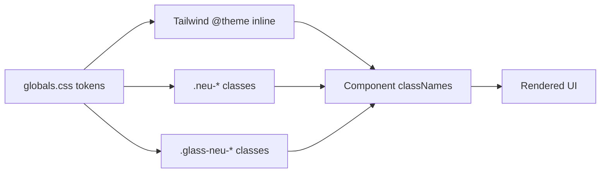

# Design Document: Design Consistency

## Overview

This is a UI consistency pass — not new features, but aligning existing components with the documented design system. The changes are surgical: replacing ad-hoc inline styles with the correct design system classes, fixing semantic color usage for dark mode, adding accessibility attributes, and correcting font weights. No new components, no new tokens, no architectural changes.

The implementation touches 5 files with ~30 lines changed total. Every change is a class swap or attribute addition — no logic changes.

## Architecture

No architectural changes. The design system infrastructure (tokens in `globals.css`, utility classes, `@theme inline` mapping) is already correct. This work fixes component-level consumption of that infrastructure.

All changes happen at the `E` layer — component classNames referencing the correct system classes.

## Components and Interfaces

### Component 1: Map Floating Controls (`src/components/map/map-panel.tsx`)

**Purpose**: Zoom buttons, route info card, and glass button overlay on the map.

**Current problem**: Uses ad-hoc `bg-surface/90 shadow-sm backdrop-blur-sm` instead of `.glass-neu-compact`.

**Fix**: Replace inline material styling with `.glass-neu-compact` on:

- `GlassButton` (line ~42)
- `RouteInfoCard` (line ~55)
- Zoom control container (line ~150)
- Mobile bottom sheet (line ~296): add `.neu-panel`, change easing to `--neu-ease`

### Component 2: Building Popup (`src/components/map/building-popup.tsx`)

**Purpose**: Slide-out panel showing building details over the map.

**Current problems**:

1. Uses ad-hoc glass styling instead of `.glass-neu-compact`
2. Uses `rounded-xl` instead of `rounded-2xl` (panels = 16px)
3. Uses raw `bg-emerald-500` / `bg-red-500` for status dots

**Fix**:

1. Replace material styling with `.glass-neu-compact`
2. `rounded-xl` → `rounded-2xl`
3. `bg-emerald-500` → `bg-secondary`, `bg-red-500` → `bg-error`

### Component 3: Session Sidebar (`src/components/shell/session-sidebar.tsx`)

**Purpose**: Left sidebar with session list and navigation.

**Current problems**:

1. Nav item height is `min-h-10` (40px) instead of `h-9` (36px)
2. Active state uses `.neu-raised border bg-surface` instead of flat `bg-accent-subtle`
3. Hover uses `bg-surface-container` instead of `bg-surface-container-high`

**Fix**: Swap classes on the nav item conditional styling.

### Component 4: Tool Renderers (`src/components/chat/tool-renderers.tsx`)

**Purpose**: Renders inline tool-call results in chat messages.

**Current problem**: Multiple "Show on map" buttons with no distinguishing aria-label.

**Fix**: Add contextual `aria-label` to each "Show on map" button with route/building/place context.

### Component 5: Chat Panel Suggestions (`src/components/chat/chat-panel.tsx`)

**Purpose**: Suggestion buttons at the bottom of chat.

**Current problem**: Uses `.neu-button rounded-xl` (raised neumorphic) instead of outline pill pattern.

**Fix**: Replace with `border border-primary text-primary rounded-full hover:bg-accent-subtle transition-colors duration-150`.

### Component 6: Minor Fixes (message.tsx, building-popup.tsx)

**Purpose**: Font weight corrections and border color.

**Fixes**:

- Assistant avatar: `font-semibold` → `font-medium`
- Building popup section headings: `font-semibold` → `font-medium`
- User bubble: add `border-border-subtle`

## Data Models

No data model changes.

## Error Handling

No error handling changes. These are purely visual class swaps.

## Testing Strategy

### Visual Verification

- Check light mode and dark mode for each changed component
- Verify status dots in building popup flip colors in dark mode
- Verify map floating controls have correct backdrop-blur and shadow
- Verify sidebar active state is flat (no shadow)
- Verify suggestion pills are outlined (no shadow)

### Accessibility Testing

- Tab through tool-result "Show on map" buttons with a screen reader
- Verify each button announces its contextual label
- Verify focus rings render correctly on rounded-full buttons

### Regression Check

- `npm run build` passes (no broken imports/classes)
- No console errors in browser

## Performance Considerations

`.glass-neu-compact` uses `backdrop-filter` which is GPU-composited. The map floating controls are already using `backdrop-blur-sm`, so switching to `.glass-neu-compact` (blur 12px vs current ~4px) may have marginal GPU cost increase on the map overlay. Acceptable since these are small, fixed-position elements.

## Security Considerations

No security implications. Purely visual changes.

## Dependencies

No new dependencies. All required CSS classes already exist in `globals.css`.
